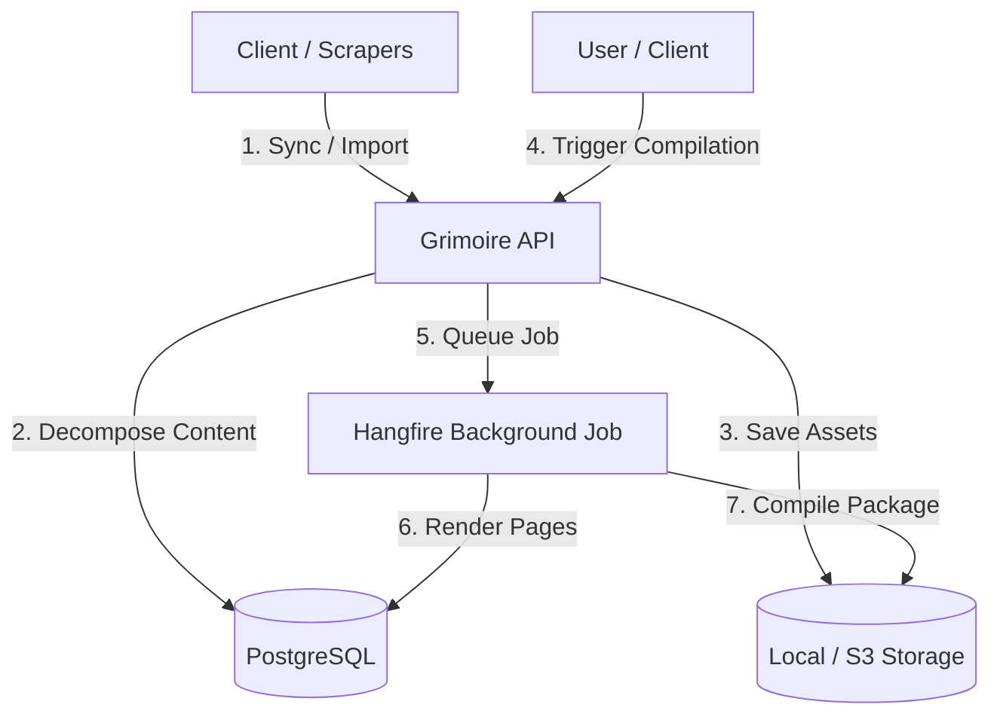

# Grimoire

[](https://github.com/fm39hz/Grimoire.NET/actions)
[](LICENSE)

Self-hosted digital book archiving and publishing engine.

---

## Overview



---

## 🚀 Quick Start

### Run Services

```bash
git clone https://github.com/fm39hz/Grimoire.NET.git
cd Grimoire.NET
docker compose up -d
```

The API interactive dashboard is available at `http://localhost:8080/scalar/v1`.

---

## 🏗️ Core Features

- **Segment-Based Content Decomposition**: Chapters are decomposed into structured text, image, and footnote segments. This isolates raw text from formatting layout, enabling safe editing.
- **Hierarchical Book Tree**: Manages Series -> Volume -> Chapter -> Segment structures with fractional ordering, allowing fast insertions and tree restructurings.
- **Content Splitting & Merging**: Supports splitting and merging chapters (by segment boundaries) and individual text segments (by character offsets) to reorganize book contents.
- **Asynchronous Publishing**: Compiles series and volumes into standards-compliant EPUB 3.3 files (with inline footnotes, cover page injection, and custom stylesheets)

---

## 📂 System Documentation

Detailed technical documents are available in the `doc/` directory:

- **[Architecture](doc/01-architecture-overview.md)**: Conceptual hierarchy and component execution flows.
- **[Data Schema](doc/02-database-schema.md)**: Entities, segments, and audit tables.
- **[API Features](doc/03-api-features.md)**: REST endpoints for file uploads, splitting, and compiling.
- **[Infrastructure](doc/04-infrastructure.md)**: Storage configurations and page template rendering.
- **[MCP Specification](doc/05-mcp-specification.md)**: Model Context Protocol design and tools specification.

---

## ⚖️ License

Distributed under the MIT License. See [LICENSE](LICENSE) for details.
