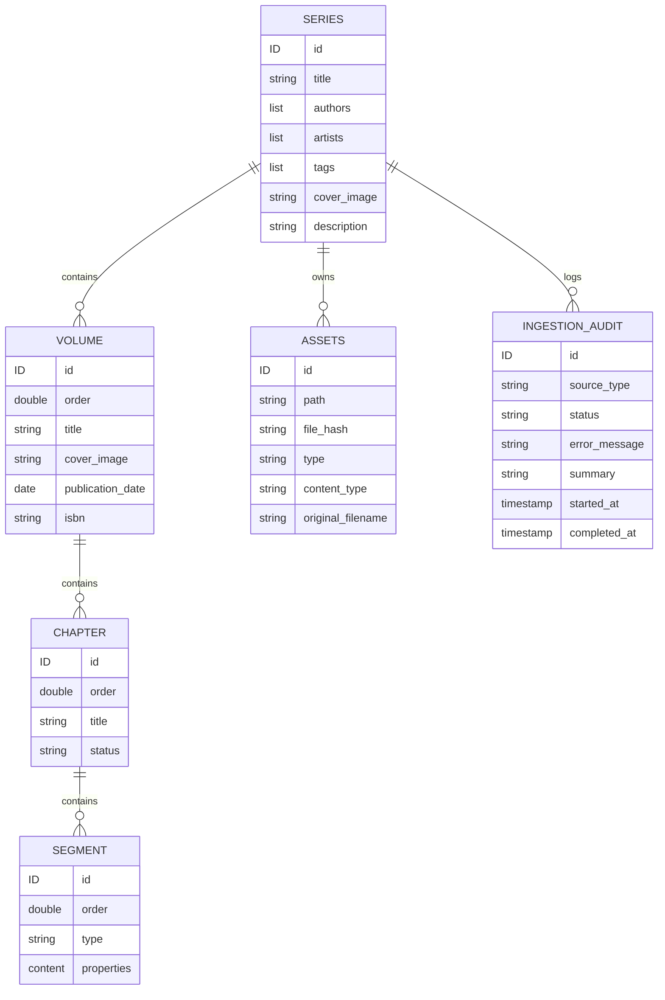

---
tags:
    - grimoire/database
---

# Volume II: Data Model Specification

Grimoire structures publications into logical entities and decomposes chapters into granular content segments.

---

## 1. Conceptual Data Model

---

## 2. Logical Entities

### 2.1. Series
Represents a collection of volumes or a standalone series.
* **Properties**:
  * Title, Authors, Illustrators, Tags, Cover image, and Description.

### 2.2. Volume
Represents a specific volume or part within a Series.
* **Properties**:
  * Title, Volume Cover, Publication Date, and ISBN.

### 2.3. Chapter
Represents a chapter containing metadata (such as status: `Draft` or `Published`). Chapters do not contain text directly; all text content is stored in child segments.

### 2.4. Content Segments
A chapter's body is split into ordered segments to separate text prose from document structure:
* **Text Segment**: Raw text strings, formatting tags (bold, italic), and footnote link keys.
* **Image Segment**: Asset path and image caption.
* **Divider Segment**: Transition divider markers.
* **Footnote Segment**: Chunks of text associated with footnote reference links.

### 2.5. Assets
Tracks media uploads (such as cover images and chapter illustrations) to prevent duplicate uploads via content hashes.

### 2.6. Ingestion Audit Records
Tracks import session status (Processing, Success, Failed) and logs errors to trace synchronization history.
