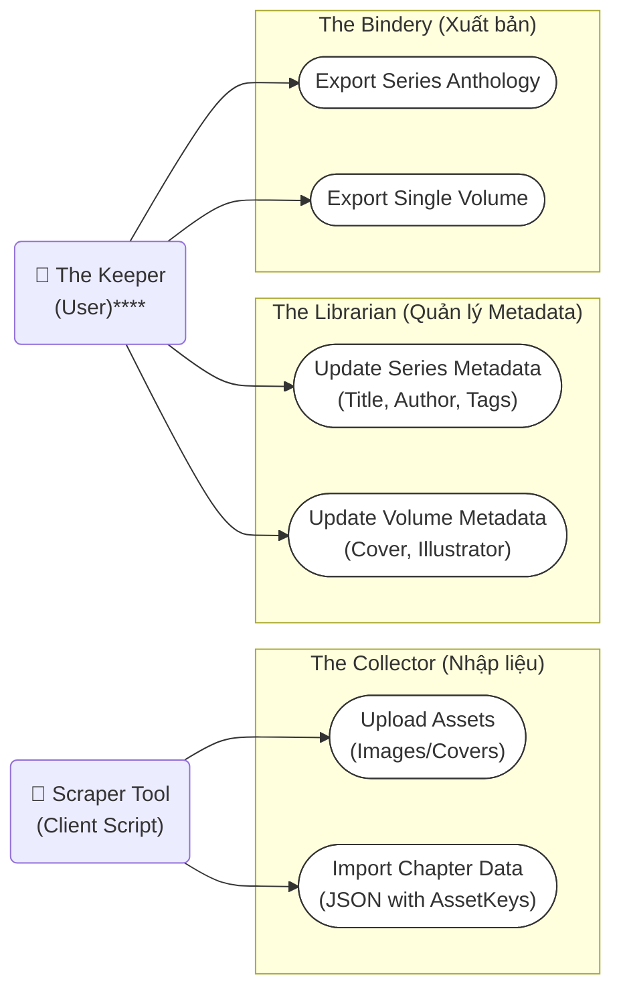
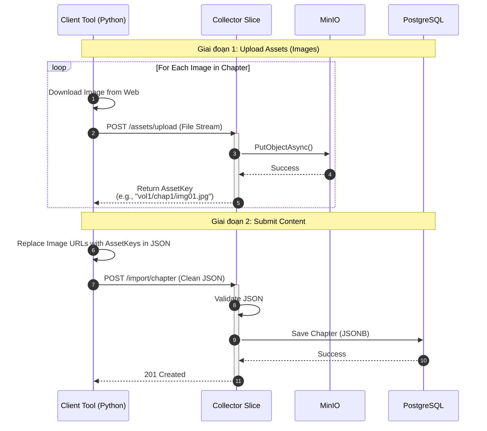
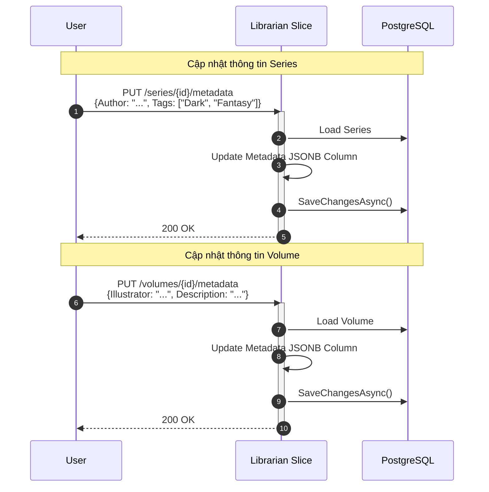
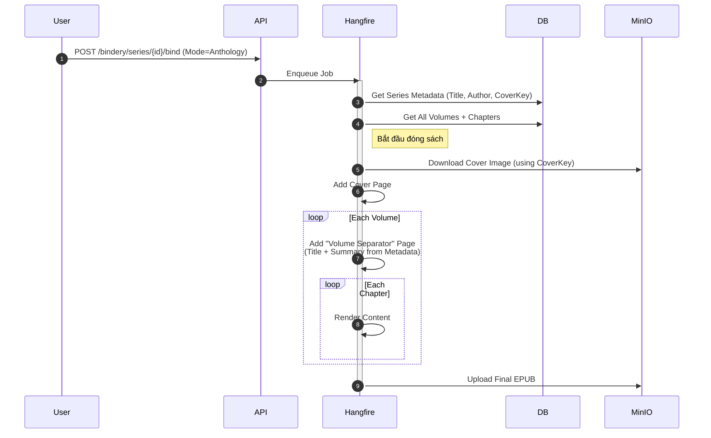
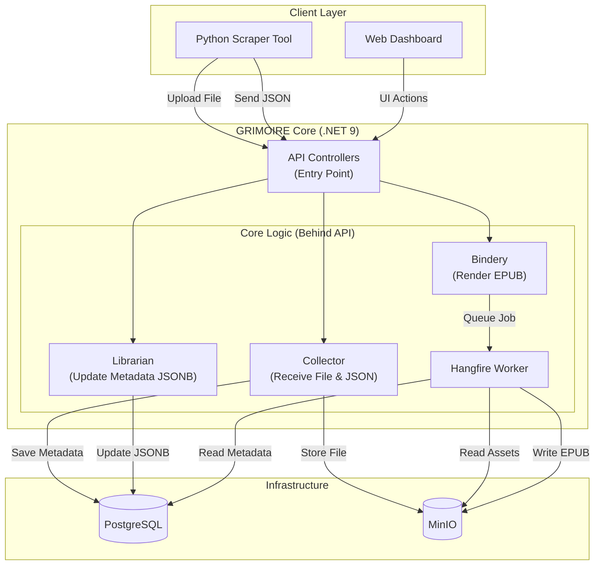

## 1\. Use Case Diagram (Cập nhật)

-----

## 2\. Sequence Diagrams (Chi tiết Luồng xử lý Mới)

### 2.1. Use Case: The "Smart Import" Workflow (Client-Side Scraping)

### 2.2. Use Case: Manage Metadata (The Librarian)

### 2.3. Use Case: Export Anthology (The Bindery)

-----

## 3\. Kiến trúc Hệ thống (Cập nhật trách nhiệm)

